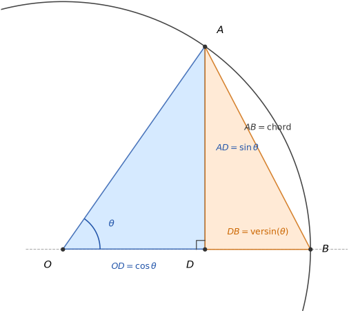

# cos(x) from Pythagoras

*Dirk J. Botha, April 2026*

---

## Abstract

Standard trigonometry computes cos(x) via polynomial approximation -- a truncated
Taylor or Chebyshev series fitted to the function. This paper takes a different
route. Starting from a single geometric construction -- two right triangles sharing
one leg on the unit circle -- we derive cos(x) and sin(x) from the versed sine
using Pythagoras alone. The one approximation in the system is a four-term series
for the versed sine at angles no larger than $1.5^\circ$, confined deliberately to
where it is most precise. The resulting algorithm matches polynomial methods in
speed and surpasses them in accuracy, achieving maximum error approximately three
times closer to the double-precision rounding floor than a Horner-form Taylor
series. The geometry was always complete. We wrote it down.

---

## Section 1 -- The Construction



We begin with a circle of radius 1, centred at the origin. A circle of radius 1 is
called a **unit circle**.

We place three points:

| Point | Coordinates                 | Description                                         |
|-------|-----------------------------|-----------------------------------------------------|
| $O$   | $(0,\ 0)$                   | centre of the circle                                |
| $B$   | $(1,\ 0)$                   | rightmost point of the circle                       |
| $A$   | $(\cos\theta,\ \sin\theta)$ | any point on the circle, at angle $\theta$ from $B$ |

From $A$, we drop a perpendicular line straight down to the $x$-axis. The foot of
that perpendicular -- the point where it meets the $x$-axis -- we call $D$:

$$D = (\cos\theta,\ 0)$$

We now have four line segments, and we give each one a name:

| Segment | Length           | Description                                   |
|---------|------------------|-----------------------------------------------|
| $OD$    | $\cos\theta$     | horizontal distance from centre to $D$        |
| $AD$    | $\sin\theta$     | vertical height of $A$ above the $x$-axis     |
| $DB$    | $1 - \cos\theta$ | remaining horizontal distance from $D$ to $B$ |
| $AB$    | $\text{chord}$   | straight line from $B$ to $A$                 |

The segment $DB$ has a historical name: the **versed sine**, or **versin** for
short.

$$\text{versin}(\theta) = 1 - \cos(\theta)$$

We can immediately rearrange this definition. Subtract 1 from both sides, then
multiply both sides by $-1$:

$$\begin{aligned}
\text{versin}(\theta) &= 1 - \cos(\theta) \\
\cos(\theta) &= 1 - \text{versin}(\theta)
\end{aligned}$$

This is not an approximation. It is a definition, rearranged. It will be the most
important line in this paper.

---

## Section 2 -- Two Triangles

Look at the four points $O$, $A$, $D$, $B$. They form two right-angled triangles,
sharing the side $AD$.

**Triangle $OAD$** has its right angle at $D$. Its three sides are:

| Side | Length       | Role                                   |
|------|--------------|----------------------------------------|
| $OD$ | $\cos\theta$ | one short side                         |
| $AD$ | $\sin\theta$ | the other short side                   |
| $OA$ | $1$          | hypotenuse (radius of the unit circle) |

Pythagoras applied to triangle $OAD$:

$$\begin{aligned}
OD^2 + AD^2 &= OA^2 \\
\cos^2\theta + \sin^2\theta &= 1
\end{aligned}$$

This is the Pythagorean identity. We will use it in a moment.

**Triangle $ADB$** has its right angle at $D$. Its three sides are:

| Side | Length                  | Role                                        |
|------|-------------------------|---------------------------------------------|
| $AD$ | $\sin\theta$            | one short side (shared with triangle $OAD$) |
| $DB$ | $\text{versin}(\theta)$ | the other short side                        |
| $AB$ | $\text{chord}$          | hypotenuse                                  |

Pythagoras applied to triangle $ADB$:

$$\begin{aligned}
AD^2 + DB^2 &= AB^2 \\
\sin^2\theta + \text{versin}^2(\theta) &= \text{chord}^2
\end{aligned}$$

We now have two equations. We want to find what $\text{chord}^2$ equals in terms of
versin alone -- so we need to eliminate $\sin^2\theta$. The first equation gives us
exactly that:

$$\sin^2\theta = 1 - \cos^2\theta$$

Before we substitute, we expand $1 - \cos^2\theta$. This uses the **difference of
two squares** rule:

$$a^2 - b^2 = (a - b) \cdot (a + b)$$

Setting $a = 1$ and $b = \cos\theta$:

$$1 - \cos^2\theta = (1 - \cos\theta) \cdot (1 + \cos\theta)$$

The factor $(1 - \cos\theta)$ is $\text{versin}(\theta)$ by definition. The factor
$(1 + \cos\theta)$ -- we substitute $\cos\theta = 1 - \text{versin}(\theta)$:

$$\begin{aligned}
1 + \cos\theta &= 1 + (1 - \text{versin}(\theta)) \\
               &= 2 - \text{versin}(\theta)
\end{aligned}$$

Putting it together, one line at a time:

$$\begin{aligned}
\sin^2\theta &= 1 - \cos^2\theta && \text{[Pythagoras on triangle } OAD\text{]} \\
             &= (1 - \cos\theta) \cdot (1 + \cos\theta) && \text{[difference of two squares]} \\
             &= \text{versin}(\theta) \cdot (1 + \cos\theta) && \text{[definition: versin} = 1 - \cos\text{]} \\
             &= \text{versin}(\theta) \cdot (2 - \text{versin}(\theta)) && \text{[substituting } \cos = 1 - \text{versin}\text{]}
\end{aligned}$$

Now substitute into the equation from triangle $ADB$:

$$\begin{aligned}
\text{chord}^2 &= \sin^2\theta + \text{versin}^2(\theta) \\
               &= \text{versin}(\theta) \cdot (2 - \text{versin}(\theta)) + \text{versin}^2(\theta) \\
               &= 2 \cdot \text{versin}(\theta) - \text{versin}^2(\theta) + \text{versin}^2(\theta) \\
               &= 2 \cdot \text{versin}(\theta)
\end{aligned}$$

The $\text{versin}^2(\theta)$ terms cancel exactly. What remains is:

$$\text{chord}^2 = 2 \cdot \text{versin}(\theta)$$

This result follows from Pythagoras alone. No approximation was made. No series was
used. The chord and the versin are connected by this exact relationship, for any
angle, on any unit circle.

---

## Section 3 -- cos and sin from versin

We now have everything we need. The work is already done -- this section collects
the results.

**cos from versin** follows directly from the definition we wrote in Section 1,
rearranged:

$$\cos(\theta) = 1 - \text{versin}(\theta)$$

No further steps. This is exact.

**sin from versin** follows from the chain we derived in Section 2. We showed that:

$$\sin^2\theta = \text{versin}(\theta) \cdot (2 - \text{versin}(\theta))$$

Taking the square root of both sides:

$$\sin(\theta) = \sqrt{\text{versin}(\theta) \cdot (2 - \text{versin}(\theta))}$$

For angles between $0^\circ$ and $90^\circ$, sin is positive, so the positive
square root is correct. We will handle angles outside this range in Section 6,
using the symmetry of the circle.

**Summary.** Given $\text{versin}(\theta)$, we can compute cos and sin exactly:

$$\begin{aligned}
\cos(\theta) &= 1 - \text{versin}(\theta) && \text{[one subtraction]} \\
\sin(\theta) &= \sqrt{\text{versin}(\theta) \cdot (2 - \text{versin}(\theta))} && \text{[one multiplication, one square root]}
\end{aligned}$$

These are not approximations. They are exact geometric consequences of Pythagoras,
applied to the two triangles in Section 2. The only thing we do not yet have is a
way to compute $\text{versin}(\theta)$ itself from the angle $\theta$. That is what
Section 4 provides.

---

## Section 4 -- The versin series

This is the one place in this paper where we leave pure geometry.

In Sections 1 through 3, every step was exact. We used only Pythagoras and the
definition of versin. No approximation was made. But we now face a practical
question: given an angle $\theta$, what is $\text{versin}(\theta)$?

The geometry tells us what versin *is* -- the height of the segment $DB$. It does
not, by itself, tell us how to *compute* it from $\theta$. For that, we need a
series.

**The series.** For any angle $\theta$ measured in radians:

$$\text{versin}(\theta) = \frac{\theta^2}{2} - \frac{\theta^4}{24} + \frac{\theta^6}{720} - \frac{\theta^8}{40320} + \cdots$$

Each term is smaller than the last. The series continues forever, but the terms
shrink so rapidly that for small $\theta$, we can stop early without losing
meaningful precision.

**Where the first term comes from.** For very small angles, the arc from $B$ to $A$
curves only slightly away from the straight line $BA$. In that limit, the arc
behaves like a parabola. The versin -- the gap between the straight line and the
highest point of the arc -- for a unit-curvature parabola of arc length $\theta$ is
exactly $\tfrac{\theta^2}{2}$. This is the dominant term, and it has a geometric
home.

The remaining terms correct for the difference between the parabola and the true
circle. Deriving them precisely requires calculus, which is beyond the scope of
this paper. We state the series, verify it numerically, and use it.

**Why four terms are enough.** In our algorithm, $\theta$ is never larger than
$1.5^\circ$ -- which in radians is approximately $0.02618$. At that maximum value:

| Term               | Value                          |                   |
|--------------------|--------------------------------|-------------------|
| $\theta^2 / 2$     | $\approx 3.43 \times 10^{-4}$  | dominant term     |
| $\theta^4 / 24$    | $\approx 1.96 \times 10^{-8}$  | first correction  |
| $\theta^6 / 720$   | $\approx 1.12 \times 10^{-12}$ | second correction |
| $\theta^8 / 40320$ | $\approx 6.37 \times 10^{-17}$ | third correction  |

The fifth term would be smaller than $10^{-21}$ -- far below what any standard
computer can represent in double-precision arithmetic. Four terms give us all the
precision the hardware can use, and then some.

**In practice.** We compute $\text{versin}(\theta)$ using Horner's method -- a
standard technique for evaluating a polynomial efficiently by nesting
multiplications to avoid repeated powers:

$$\begin{aligned}
e_2 &= \theta \cdot \theta \\
\text{versin} &= e_2 \cdot \left(\frac{1}{2} - e_2 \cdot \left(\frac{1}{24} - e_2 \cdot \left(\frac{1}{720} - \frac{e_2}{40320}\right)\right)\right)
\end{aligned}$$

The result is $\text{versin}(\theta)$ to within the limits of double-precision
floating point. From here, Section 3's exact formulas take over:

$$\begin{aligned}
\cos(\theta) &= 1 - \text{versin} \\
\sin(\theta) &= \sqrt{\text{versin} \cdot (2 - \text{versin})}
\end{aligned}$$

The approximation is confined entirely to the versin series. Everything before and
after it is exact.

---

## Section 5 -- The table

The versin series in Section 4 works best when $\theta$ is small. Four terms give
machine precision for $\theta$ up to $1.5^\circ$ -- but if we needed to compute
$\cos(47^\circ)$ with $\theta = 47^\circ$, we would need many more terms. The
solution is a lookup table: a pre-computed list of exact values at regular
intervals. We find the nearest entry, compute a small residual from there, and let
the series handle only that small gap.

**What we need.** A table entry every $3^\circ$, covering $0^\circ$ to $90^\circ$.
The worst-case residual is then $1.5^\circ$ -- exactly within our four-term budget.
This gives 31 entries in total.

**Where the table values come from.** We do not estimate these values. We derive
them exactly from geometry, using five angles that can be constructed from regular
polygons.

The **equilateral triangle** -- three equal sides, three equal angles -- has angles
of exactly $60^\circ$. Bisect one angle: $30^\circ$.

The **isosceles right triangle** -- two equal short sides, one right angle -- has
the two remaining angles equal. They must sum to $90^\circ$, so each is exactly
$45^\circ$.

The **regular pentagon** -- five equal sides, five equal angles -- has interior
angles of $108^\circ$. Its diagonals create isosceles triangles with angles
$72^\circ$--$72^\circ$--$36^\circ$. Bisect the $36^\circ$ angle: $18^\circ$.

From these constructions, the exact values of sin and cos at $18^\circ$, $30^\circ$,
$45^\circ$, $60^\circ$, and $72^\circ$ can be written down without approximation,
using only square roots and fractions:

$$\begin{aligned}
\sin(30^\circ) &= \tfrac{1}{2} & \cos(30^\circ) &= \tfrac{\sqrt{3}}{2} \\
\sin(45^\circ) &= \tfrac{\sqrt{2}}{2} & \cos(45^\circ) &= \tfrac{\sqrt{2}}{2} \\
\sin(60^\circ) &= \tfrac{\sqrt{3}}{2} & \cos(60^\circ) &= \tfrac{1}{2}
\end{aligned}$$

We also include $0^\circ$ ($\sin = 0$, $\cos = 1$) and $90^\circ$ ($\sin = 1$,
$\cos = 0$) which follow immediately from the construction.

**Getting to $3^\circ$.** We now use the angle subtraction formulas. For any two
angles $A$ and $B$:

$$\begin{aligned}
\sin(A - B) &= \sin(A) \cdot \cos(B) - \cos(A) \cdot \sin(B) \\
\cos(A - B) &= \cos(A) \cdot \cos(B) + \sin(A) \cdot \sin(B)
\end{aligned}$$

These formulas follow from geometry -- a proof exists on the unit circle using the
same construction methods -- but we take them as given here and apply them.

First: $45^\circ - 30^\circ = 15^\circ$

$$\begin{aligned}
\sin(15^\circ) &= \sin(45^\circ) \cdot \cos(30^\circ) - \cos(45^\circ) \cdot \sin(30^\circ) \\
\cos(15^\circ) &= \cos(45^\circ) \cdot \cos(30^\circ) + \sin(45^\circ) \cdot \sin(30^\circ)
\end{aligned}$$

Then: $18^\circ - 15^\circ = 3^\circ$

$$\begin{aligned}
\sin(3^\circ) &= \sin(18^\circ) \cdot \cos(15^\circ) - \cos(18^\circ) \cdot \sin(15^\circ) \\
\cos(3^\circ) &= \cos(18^\circ) \cdot \cos(15^\circ) + \sin(18^\circ) \cdot \sin(15^\circ)
\end{aligned}$$

We now have exact values for $\sin(3^\circ)$ and $\cos(3^\circ)$. Using the angle
addition formulas at each step -- $\sin(A + 3^\circ)$ and $\cos(A + 3^\circ)$ --
we can walk from $3^\circ$ to $90^\circ$ in steps of $3^\circ$. Where a base angle
is known exactly ($18^\circ$, $30^\circ$, $45^\circ$, $60^\circ$, $72^\circ$), we
use that value directly rather than the stepped result, to prevent any small
rounding errors from accumulating across steps.

The result is 31 entries -- one for every multiple of $3^\circ$ from $0^\circ$ to
$90^\circ$ -- each exact to the limits of the arithmetic used.

**The table is a cache.** It exists for speed. The geometry of the unit circle was
already complete without it. For a single angle, one could halve the angle
repeatedly until it is small, apply the series, then double back up using the angle
addition formulas -- no table required. The table is simply the agreement between
the geometry and the hardware: store 31 values once, skip the halvings every time.
The geometry does not depend on this choice.

---

## Section 6 -- The full computation

We now have all the pieces. This section assembles them into a complete algorithm
for computing $\cos(\theta)$ and $\sin(\theta)$ for any angle $\theta$.

We walk through the steps in order, then illustrate with a concrete example.

---

**Step 1 -- Reduce to one full circle.**

Any angle can be reduced to the range $[0^\circ, 360^\circ)$ by subtracting or
adding multiples of $360^\circ$. The circle repeats exactly every $360^\circ$, so
cos and sin are unchanged.

$$\theta \;\to\; \theta \bmod 360^\circ$$

---

**Step 2 -- Reflect to the first quadrant.**

The full circle has a four-fold symmetry. Every angle maps to a reference angle in
the first quadrant $[0^\circ, 90^\circ]$ by reflection. The sign of cos and sin
depends on which quadrant we started in.

| Quadrant | Range                    | Reference angle      | $\sin$              | $\cos$              |
|----------|--------------------------|----------------------|---------------------|---------------------|
| Q1       | $[0^\circ, 90^\circ)$    | $\theta$             | $+\sin(\text{ref})$ | $+\cos(\text{ref})$ |
| Q2       | $[90^\circ, 180^\circ)$  | $180^\circ - \theta$ | $+\sin(\text{ref})$ | $-\cos(\text{ref})$ |
| Q3       | $[180^\circ, 270^\circ)$ | $\theta - 180^\circ$ | $-\sin(\text{ref})$ | $-\cos(\text{ref})$ |
| Q4       | $[270^\circ, 360^\circ)$ | $360^\circ - \theta$ | $-\sin(\text{ref})$ | $+\cos(\text{ref})$ |

To see why the signs work: on the unit circle, moving from Q1 into Q2 reflects the
point across the vertical axis. The height (sin) stays positive; the horizontal
position (cos) becomes negative. Moving into Q3 reflects across both axes -- both
become negative. Moving into Q4 reflects across the horizontal axis -- sin becomes
negative, cos returns to positive.

We record the signs, then work entirely with the reference angle from here on.

---

**Step 3 -- Find the nearest table entry.**

We look up the nearest multiple of $3^\circ$ to our reference angle. Call it $A$.
The residual is:

$$\theta_r = \text{reference} - A \quad \text{(in radians)}$$

The magnitude of $\theta_r$ is at most $1.5^\circ$, which in radians is at most
$0.02618$. This is the small angle the series requires.

Note: $\theta_r$ can be positive or negative. If the nearest table entry is *above*
the reference angle, $\theta_r$ is negative. We record the sign of $\theta_r$ --
we will need it for $\sin(\theta_r)$.

---

**Step 4 -- Compute $\text{versin}(\theta_r)$, then $\cos(\theta_r)$ and $\sin(\theta_r)$.**

$$\begin{aligned}
e_2 &= \theta_r \cdot \theta_r \\
\text{versin} &= e_2 \cdot \left(\frac{1}{2} - e_2 \cdot \left(\frac{1}{24} - e_2 \cdot \left(\frac{1}{720} - \frac{e_2}{40320}\right)\right)\right)
\end{aligned}$$

$$\begin{aligned}
\cos(\theta_r) &= 1 - \text{versin} \\
\sin(\theta_r) &= \sqrt{\text{versin} \cdot (2 - \text{versin})} \times \text{sign}(\theta_r)
\end{aligned}$$

The square root is always positive; we restore the sign of $\theta_r$ afterwards.
$\cos(\theta_r)$ needs no sign adjustment -- cosine is the same for $+\theta_r$ and
$-\theta_r$.

---

**Step 5 -- Combine with the table entry.**

We have the table values $(\sin A,\ \cos A)$ and the correction
$(\sin\theta_r,\ \cos\theta_r)$. The angle addition formulas give us the full
result:

$$\begin{aligned}
\sin(\text{reference}) &= \sin(A) \cdot \cos(\theta_r) + \cos(A) \cdot \sin(\theta_r) \\
\cos(\text{reference}) &= \cos(A) \cdot \cos(\theta_r) - \sin(A) \cdot \sin(\theta_r)
\end{aligned}$$

---

**Step 6 -- Apply the quadrant signs from Step 2.**

Multiply the results by the signs recorded in Step 2. This gives the final
$\cos(\theta)$ and $\sin(\theta)$.

---

**A worked example.** Compute $\cos(247^\circ)$ and $\sin(247^\circ)$.

*Step 1:* $247^\circ$ is already in $[0^\circ, 360^\circ)$.

*Step 2:* $247^\circ$ is in Q3 ($180^\circ$ to $270^\circ$). Reference
$= 247^\circ - 180^\circ = 67^\circ$. Signs: sin will be negative, cos will be
negative.

*Step 3:* Nearest multiple of $3^\circ$ to $67^\circ$ is $66^\circ$. Table gives
$\sin(66^\circ)$ and $\cos(66^\circ)$. $\theta_r = 67^\circ - 66^\circ = 1^\circ
= 0.01745\ \text{rad}$. $\theta_r$ is positive.

*Step 4:*

$$\begin{aligned}
e_2 &= 0.01745^2 \approx 3.046 \times 10^{-4} \\
\text{versin} &\approx e_2 \times 0.5 \approx 1.523 \times 10^{-4} \quad \text{(higher terms negligible at } 1^\circ\text{)} \\
\cos(\theta_r) &= 1 - \text{versin} \approx 0.99985 \\
\sin(\theta_r) &= \sqrt{\text{versin} \cdot (2 - \text{versin})} \approx 0.01745
\end{aligned}$$

*Step 5:* Combine with table entry for $66^\circ$:

$$\begin{aligned}
\sin(67^\circ) &= \sin(66^\circ) \cdot \cos(1^\circ) + \cos(66^\circ) \cdot \sin(1^\circ) \\
\cos(67^\circ) &= \cos(66^\circ) \cdot \cos(1^\circ) - \sin(66^\circ) \cdot \sin(1^\circ)
\end{aligned}$$

*Step 6:* Apply Q3 signs -- both negative:

$$\begin{aligned}
\sin(247^\circ) &= -\sin(67^\circ) \\
\cos(247^\circ) &= -\cos(67^\circ)
\end{aligned}$$

Every step is arithmetic. The only approximation was the versin series in Step 4.

**A spreadsheet is enough.** This algorithm is simple enough to implement in a
spreadsheet. A verification of $\cos(1^\circ)$ in LibreOffice Calc, using four
terms of the versin series, produced agreement with the standard library value to
12 decimal places. No compiled code required. A student with a spreadsheet and this
paper has everything they need.

---

## Section 7 -- Results

We tested the algorithm against the standard `<cmath>` library functions, which
represent the current benchmark for double-precision trigonometry on most platforms.

**The test.** 36,001 angles from $0^\circ$ to $360^\circ$ in steps of $0.01^\circ$.
For each angle, we computed both sin and cos using each method, and measured the
largest error found across all angles and both functions. The reference values were
taken from `<cmath>`.

**Accuracy results:**

| Method | Maximum error |
|--------|---------------|
| Horner | $2.20 \times 10^{-15}$ |
| Versin | $7.77 \times 10^{-16}$ |
| Half-angle | $8.05 \times 10^{-16}$ |

To put these numbers in context: double-precision arithmetic on any standard
computer represents numbers to about 15--16 significant decimal digits. The smallest
difference the hardware can represent near the value 1.0 is approximately
$2.2 \times 10^{-16}$. A computation involving many steps naturally accumulates
errors several times larger than this floor.

The Horner result ($2.20 \times 10^{-15}$) is typical for a well-implemented
polynomial method -- about ten times the single-step rounding floor. This is not a
criticism; it is the expected behaviour of a truncated series.

The geometric methods (versin and half-angle) achieve roughly three times better
accuracy than Horner, landing closer to the theoretical minimum for a computation
of this complexity. The reason is structural: the final step in both geometric
methods is an exact trig identity --
$\cos(\theta) = 1 - \text{versin}(\theta)$ and
$\sin(\theta) = \sqrt{\text{versin}(\theta) \cdot (2 - \text{versin}(\theta))}$ --
not a polynomial approximation. The error budget is spent almost entirely on
floating-point rounding, not on series truncation. The geometry absorbs what the
algebra would have discarded.

**Speed results** (20 million sin/cos pairs, -O3 optimisation, standard desktop CPU):

| Method     | Throughput   |            |
|------------|--------------|------------|
| Horner     | 56.3 M ops/s |            |
| Half-angle | 54.3 M ops/s | $(-3.6\%)$ |
| Chord-geo  | 52.4 M ops/s | $(-7\%)$   |
| Versin     | 51.1 M ops/s | $(-9\%)$   |

Horner is fastest. The geometric methods are within 10%. For applications where
precision matters more than throughput -- navigation, orbital mechanics, signal
processing, scientific computation -- the accuracy advantage of the geometric
approach is the relevant number.

**The code.** A complete C++ implementation of all four methods -- including the
31-entry geometric table, all residual corrections, quadrant reflection, and the
accuracy and throughput benchmarks -- is available at:

```
https://github.com/TheLastCylon/ouroboros_mathematics/blob/main/research_results/trigonometry/source_code/c++/trig_methods_benchmark.cpp 
```

The code compiles with a single command and requires no dependencies beyond a
standard C++ compiler.

---

## Section 8 -- The half-angle connection

We return to the construction in Section 1, and look at it one more time.

The chord $AB$ connects the point $B = (1, 0)$ to the point
$A = (\cos\theta,\ \sin\theta)$. It is a straight line cutting across the circle.
This chord has a name that is over a thousand years old.

In Sanskrit, it was called the **jya** -- the bowstring. The arc from $B$ to $A$
is the bow. The chord is the string. And $\sin(\theta)$ is exactly half the length
of that string.

This is not a coincidence or a definition chosen for convenience. It is what sin
*is*, geometrically. The sine of an angle is half the chord that angle subtends on
the unit circle.

Written as a formula (where $\mathbin{:}$ denotes the ratio relationship):

$$\text{chord} = 2 \cdot \sin(\theta \mathbin{:} 2)$$

The chord subtended by angle $\theta$ equals twice the sine of half that angle.
This is exact -- no approximation, no series. Pure geometry.

---

Now recall the result from Section 2:

$$\text{chord}^2 = 2 \cdot \text{versin}(\theta)$$

We have two expressions for $\text{chord}^2$. Set them equal:

$$\begin{aligned}
\left(2 \cdot \sin(\theta \mathbin{:} 2)\right)^2 &= 2 \cdot \text{versin}(\theta) \\
4 \cdot \sin^2(\theta \mathbin{:} 2) &= 2 \cdot \text{versin}(\theta)
\end{aligned}$$

Divide both sides by 2:

$$\text{versin}(\theta) = 2 \cdot \sin^2(\theta \mathbin{:} 2)$$

And since $\cos(\theta) = 1 - \text{versin}(\theta)$:

$$\cos(\theta) = 1 - 2 \cdot \sin^2(\theta \mathbin{:} 2)$$

This is an exact identity. It is also one of the standard double-angle formulas --
derived here from nothing but the bowstring and two triangles. No algebra borrowed
from elsewhere. The geometry produced it.

---

The second double-angle identity follows by the same route:

$$\sin(\theta) = 2 \cdot \sin(\theta \mathbin{:} 2) \cdot \cos(\theta \mathbin{:} 2)$$

Together, these two identities form the **half-angle method**: compute
$\sin(\theta \mathbin{:} 2)$ and $\cos(\theta \mathbin{:} 2)$ using the versin
series at the smaller angle $\theta \mathbin{:} 2 \leq 0.75^\circ$, then apply
both identities exactly. No approximation in the final step. The series works at a
smaller argument, where it is even more precise.

This is why the half-angle method achieves its accuracy -- it pushes the one
approximation to a smaller angle, then closes with exact geometry.

---

**The shape of what we built.**

Everything in this paper follows from one construction: three points on a unit
circle, one perpendicular, two right triangles sharing a leg. Pythagoras applied
twice. The versin$^2$ terms cancel.

From that cancellation:

$$\text{chord}^2 = 2 \cdot \text{versin}(\theta)$$

From the bowstring:

$$\text{chord} = 2 \cdot \sin(\theta \mathbin{:} 2)$$

From these two facts, combined:

$$\begin{aligned}
\cos(\theta) &= 1 - \text{versin}(\theta) && \text{[exact]} \\
\sin(\theta) &= \sqrt{\text{versin}(\theta) \cdot (2 - \text{versin}(\theta))} && \text{[exact]} \\
\cos(\theta) &= 1 - 2 \cdot \sin^2(\theta \mathbin{:} 2) && \text{[exact]} \\
\sin(\theta) &= 2 \cdot \sin(\theta \mathbin{:} 2) \cdot \cos(\theta \mathbin{:} 2) && \text{[exact]}
\end{aligned}$$

The only approximation in the entire system is the versin series -- four terms,
confined to a small angle, producing results within three times the rounding floor
of double-precision arithmetic.

The geometry was always complete. We just had to look.

---

## Section 9 -- Related Work

The individual mathematical facts in this paper are all classical. The contribution
is the algorithm -- the specific combination of geometric construction, exact
identities, and confined series approximation -- and the accuracy measurement that
follows from it.

**The versed sine.** The versin appears in Sanskrit mathematical astronomy as early
as Aryabhata (5th century CE), where it is called the *utkrama-jya* (reversed
chord). Ptolemy's *Almagest* (2nd century CE) uses chord tables on a circle of
radius 60, from which versin values are implicit. The identity
$\text{versin}(\theta) = 1 - \cos(\theta)$ and the chord--versin relationship
$\text{chord}^2 = 2 \cdot \text{versin}(\theta)$ are consequences of that
tradition.

**The haversine.** The identity derived in Section 8,

$$\text{versin}(\theta) = 2 \cdot \sin^2(\theta \mathbin{:} 2)$$

is the haversine relation. The haversine $\text{hav}(\theta) = \text{versin}(\theta)
\mathbin{:} 2$ was introduced by James Inman (1835) for navigation tables,
specifically because it is numerically stable at small angles -- near $\theta = 0$,
both $\sin(\theta)$ and $\cos(\theta)$ suffer cancellation errors, but the
haversine does not. The numerical stability that 19th-century navigators exploited
has the same geometric origin as the accuracy advantage measured in Section 7: the
final computation is an exact identity, not a polynomial approximation, so the
series error does not compound.

**CORDIC.** Volder's CORDIC algorithm (1959) computes trigonometric functions via
iterative rotation on the unit circle. The versin geometry appears naturally in the
CORDIC unit-circle diagram, but CORDIC does not make the two-triangle derivation or
use versin as the basis of a direct series computation. The approaches are
independent.

**Standard polynomial methods.** The current standard for double-precision
trigonometry is a Horner-form minimax polynomial (Chebyshev or Taylor) combined
with range reduction (Cody and Waite, 1980). This achieves the $2.20 \times
10^{-15}$ maximum error shown in Section 7. The geometric methods in this paper
achieve $7.77 \times 10^{-16}$ -- roughly three times closer to the rounding floor
-- because the polynomial approximation is confined to the versin series alone, and
the final recovery of cos and sin from versin is exact.

**A note on access.** Zhiheng and Dongcheng (2011) present a multiple-angle
algorithm for computing arbitrary-angle trigonometric functions and, according to a
visible excerpt, explicitly name and use the versed sine: *"is used in this
algorithm, named versed sine. But it is now little-used."* The full text of this
paper is locked behind an institutional paywall and was not accessible to the
authors at time of writing -- a situation that does not serve the goal of open
scientific discourse. Based on the available excerpt, their approach appears to use
versin as a computational intermediate in a multiple-angle scheme, rather than as
the geometric foundation of the derivation presented here. If the full text reveals
a closer relationship, the authors welcome the correction.

**What appears to be new.** The two-triangle geometric derivation as the *foundation*
of a competitive computational algorithm, the accuracy comparison against Horner on
modern hardware, and the unified geometric account connecting versin, chord, jya,
haversine, and the double-angle identities through a single construction.
