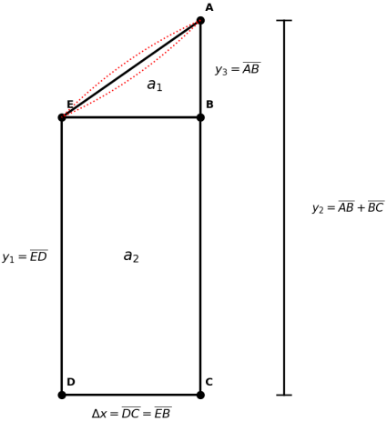

# Integration; A Geometric Account
### Dirk J. Botha, April 2026

---

## 1. The Question

What is the area between a curve $y = f(x)$, the $x$-axis, and two
vertical lines $x = x_1$ and $x = x_2$?

This is a geometric question. It has a geometric answer.

---

## 2. The Right Shape

Given two points on the curve:

$$P_1 = (x_1,\ f(x_1)), \qquad P_2 = (x_2,\ f(x_2))$$

connect them with a straight line; the chord. The shape enclosed
between the chord, the two vertical lines, and the $x$-axis is a
trapezoid.

A trapezoid decomposes into two parts:

- a **rectangle** of width $\Delta x = x_2 - x_1$ and height $y_1 = f(x_1)$
- a **triangle** of base $\Delta x$ and height $y_2 - y_1$, where $y_2 = f(x_2)$

Their areas:

$$\begin{aligned}
a_2 &= y_1 \cdot \Delta x \qquad &\text{(rectangle)} \\
a_1 &= (y_2 - y_1) \cdot \Delta x \mathbin{:} 2 \qquad &\text{(triangle)}
\end{aligned}$$

Total trapezoid area:

$$\begin{aligned}
O &= y_1 \cdot \Delta x \ + \ (y_2 - y_1) \cdot \Delta x \mathbin{:} 2 \\
  &= \Delta x \cdot (2 y_1 + y_2 - y_1) \mathbin{:} 2 \\
  &= \Delta x \cdot (y_1 + y_2) \mathbin{:} 2
\end{aligned}$$

This is a $\mathbin{:}$ relationship between the interval width and the
two function values at its endpoints. No limit. No approximation. The
shape is exact.

---

## 3. The Full Area

For $f(x)$ over an interval $[a, b]$, partition the interval at points
$x_1, x_2, \ldots, x_n$. The total area is a finite sum of trapezoid
areas:

$$A = \sum_{i=1}^{n-1} \Delta x_i \cdot (f(x_i) + f(x_{i+1})) \mathbin{:} 2$$

where $\Delta x_i = x_{i+1} - x_i$.

This is the complete statement for the area of the trapezoid. Sigma notation
closes it. No integral sign is needed. What remains is the error correction
for the parabolic sliver.

---

## 4. The Sliver

The trapezoid uses a chord. The chord is straight; the curve is not.
The gap between them (the sliver) is the remaining error.

The dotted lines in the diagram show both cases: the curve may bulge
away from the chord on either side. The sliver is always present
unless $f$ is linear over the interval.

Two geometric facts about the sliver:

1. It is bounded on one side by the chord and on the other by the curve.
2. Any smooth curve is indistinguishable from a parabola over a
   sufficiently short interval.

The sliver is a parabolic segment.

---

## 5. The Parabolic Segment

A parabolic segment has an exact area formula requiring no derivatives:

$$\text{segment area} = \tfrac{2}{3} \cdot \Delta x \cdot \left( y_{\text{mid}} - (y_1 + y_2) \mathbin{:} 2 \right)$$

where $y_{\text{mid}} = f\left(\tfrac{x_1 + x_2}{2}\right)$ is the
function value at the interval midpoint, and
$(y_1 + y_2) \mathbin{:} 2$ is the chord height at that same point.

The quantity $y_{\text{mid}} - (y_1 + y_2) \mathbin{:} 2$ is the
vertical distance from the chord to the curve at the midpoint; the
bulge height. It is positive when the curve lies above the chord,
negative when below.

---

## 6. The Three-Point Formula

Adding the trapezoid and the parabolic segment:

$$A = \Delta x \cdot (y_1 + y_2) \mathbin{:} 2 \ + \ \tfrac{2}{3} \cdot \Delta x \cdot \left( y_{\text{mid}} - (y_1 + y_2) \mathbin{:} 2 \right)$$

Expanding:

$$A = (\Delta x \mathbin{:} 6) \cdot (y_1 + 4 \cdot y_{\text{mid}} + y_2)$$

Three function evaluations. No derivatives. Exact for polynomials of
degree $\leq 3$.

This is Simpson's rule. The standard derivation reaches it by
polynomial interpolation. This derivation reaches it by geometry;
trapezoid plus parabolic segment. Same formula. Different road.

For $n$ intervals the full sum is:

$$A = \sum_{i=1}^{n-1} (\Delta x_i \mathbin{:} 6) \cdot \left( f(x_i) + 4 \cdot f\left(\tfrac{x_i + x_{i+1}}{2}\right) + f(x_{i+1}) \right)$$

---

## 7. What Was Removed

The Riemann approach uses rectangles. A rectangle of width $\Delta x$
misses the area between its flat top and the curve; an error
proportional to $\Delta x$ per interval. To eliminate that error,
$\Delta x$ must go to zero. The limit is the mechanism for doing so.

The trapezoid captures the rectangle and the triangle exactly. The
remaining error (the parabolic sliver) is proportional to
$\Delta x^3$ per interval, two orders smaller. It has a direct
geometric formula. The limit was invented to compensate for the
rectangle. The rectangle was the wrong shape.

What is removed:

| Removed                    | Replaced by                                 |
|----------------------------|---------------------------------------------|
| The limit                  | Finite $\mathbin{:}$ ratios                 |
| The rectangle              | The trapezoid                               |
| The Riemann sum            | A finite $\Sigma$ of exact trapezoid areas  |
| The integral sign $\int$   | $\Sigma$ notation is the complete statement |
| $\varepsilon$-$\delta$     | Not needed. No limit process is present     |

What is kept: every area the Riemann integral ever computed.

---

## 8. Clarification

Nothing we do here is new. Geometry always had the answer. We are still summing
areas.

What we get rid of is:
1. The notational baggage of limits and epsilon delta.
2. The educational trauma associated with both.

---

- *Notation register: [`../notation.md`](../notation.md)*
- *Test results: [`test_results.md`](test_results.md)*
- *Open questions: [`open_questions.md`](open_questions.md)*
