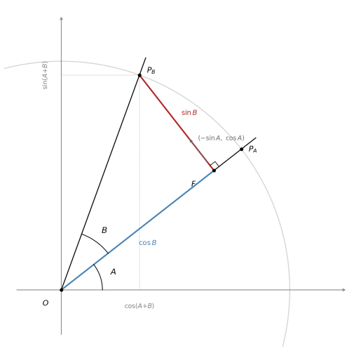

# Angle Addition
### Dirk J. Botha, April 2026

---

Given the $\mathbin{:}$ ratios for two angles $A$ and $B$ separately,
what are the $\mathbin{:}$ ratios for their sum $A + B$?

The derivation is geometric throughout. No algebra enters.

---

## 1. The Construction

Work on the unit circle -- $\text{hyp} = 1$ everywhere.

Place point $P_A$ at angle $A$ on the unit circle:

$$P_A = (\cos A,\ \sin A)$$

The point $P_B$ at angle $A + B$ is $P_A$ rotated by angle $B$. Drop
a perpendicular from $P_B$ onto the ray $OP_A$. Call the foot $F$.

In the right triangle $OFP_B$:

$$\begin{aligned}
\text{angle at } O &= B \quad \text{(the rotation angle)} \\
OP_B &= 1 \quad \text{(unit circle)} \\
OF   &= \cos B \quad \text{(distance along ray } OP_A \text{)} \\
FP_B &= \sin B \quad \text{(distance perpendicular to } OP_A \text{)}
\end{aligned}$$

---

## 2. Locating F

$F$ lies on ray $OP_A$ at distance $\cos B$ from $O$. The ray points
in direction $(\cos A,\ \sin A)$, so:

$$F = \cos B \cdot (\cos A,\ \sin A) = (\cos A \cdot \cos B,\ \sin A \cdot \cos B)$$

---

## 3. Where the Minus Sign Lives

The segment $FP_B$ is perpendicular to ray $OP_A$. The ray points in
direction $(\cos A,\ \sin A)$. Rotating this $90°$ counterclockwise
gives the perpendicular direction:

$$\text{perpendicular} = (-\sin A,\ \cos A)$$

**This is where the minus sign lives.** Not in algebra. Not in sign
management. It is the direction of a $90°$ rotation -- visible in the
geometry before any calculation begins. The $\sin B$ component of the
displacement travels in direction:

$$-\sin A$$

The subtraction is in the construction.

---

## 4. The Coordinates of $P_B$

$$\begin{aligned}
P_B &= F + \sin B \cdot (-\sin A,\ \cos A) \\
    &= (\cos A \cdot \cos B - \sin A \cdot \sin B,\quad \sin A \cdot \cos B + \cos A \cdot \sin B)
\end{aligned}$$

Reading off the two coordinates:

$$\boxed{\cos(A + B) = \cos A \cdot \cos B - \sin A \cdot \sin B}$$

$$\boxed{\sin(A + B) = \sin A \cdot \cos B + \cos A \cdot \sin B}$$

Both results -- and the minus sign between them -- were fully determined
by the shape of the construction before a single named function appeared.

---

## 5. Immediate Consequences

### Double angle

Set $B = A$:

$$\begin{aligned}
\cos(2A) &= \cos^2 A - \sin^2 A \\
\sin(2A) &= 2 \cdot \sin A \cdot \cos A
\end{aligned}$$

One substitution. No new construction.

### Angle subtraction

Replace $B$ with $-B$. From the geometry: reflecting across the
$\text{adj}$-axis reverses the sign of $\text{opp}$ and leaves
$\text{adj}$ unchanged, so $\sin(-B) = -\sin B$ and $\cos(-B) = \cos B$.
Therefore:

$$\begin{aligned}
\cos(A - B) &= \cos A \cdot \cos B + \sin A \cdot \sin B \\
\sin(A - B) &= \sin A \cdot \cos B - \cos A \cdot \sin B
\end{aligned}$$

---

## 6. The Computation Path

With the five special angles from [`special_angles.md`](special_angles.md)
and the addition formula, every angle reachable by combining those five
is computable exactly:

$$\sin(75°) = \sin(45° + 30°) \quad \text{-- one application}$$

$$\sin(15°) = \sin(45° - 30°) \quad \text{-- subtraction formula}$$

The five base angles have a greatest common divisor of $3°$. Applying
the formula recursively, every integer multiple of $3°$ is reachable in
a finite number of steps. Each step is exact. No series. No approximation.

The Taylor series -- the current standard method for computing
trigonometric values -- is an algebraic route to the same values, built
because this geometric route was not followed. The geometric route was
always there.

---

- *Notation register: [`../notation.md`](../notation.md)*
- *Previous: [`special_angles.md`](./special_angles.md)*
- *Next: [`the_sphere.md`](./the_sphere.md)*
